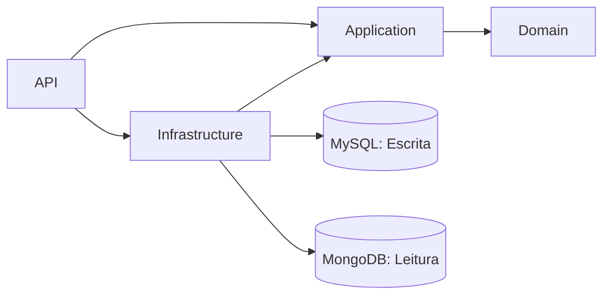

## FCG - FIAP Cloud Games

<p align="left">
    <a href="https://github.com/leticia-kojima/tech-challenge-net-phase-1/actions/workflows/ci-build-and-test.yml">
        
    </a>
</p>

**MVP para uma plataforma de jogos voltados para a educação de tecnologia.**

A plataforma **FCG - FIAP Cloud Games** é um MVP voltado para a educação em tecnologia, com foco na venda de jogos digitais e gestão de servidores para partidas online. Este documento detalha a organização do projeto, ferramentas utilizadas, diagramas explicativos, arquitetura planejada, requisitos técnicos e instruções para execução e migrações. Confira as seções abaixo para mais informações:

## Sumário
- **[Organização](#organização):** Estrutura do time, reuniões e fluxo de trabalho.
- **[Ferramentas](#ferramentas):** Tecnologias e plataformas utilizadas no projeto.
- **[Diagramas](#diagramas):** Representações visuais do sistema, como Storytelling e Event Storming.
- **[Arquitetura](#arquitetura):** Estrutura do projeto e bibliotecas empregadas.
- **[Endpoints](#endpoints):** Lista dos principais endpoints da API, métodos HTTP, caminhos e descrições das funcionalidades.
- **[Execução](#execução):** Requisitos, configuração e instruções para rodar o projeto.
- **[Testes](#testes):** Execução dos testes unitários, geração de relatórios de cobertura e funcionamento do pipeline automatizado.
- **[Migrations](#migrations):** Comandos para gerenciar alterações no banco de dados.

## Organização

Reuniões semanais são realizadas para acompanhar o progresso das tarefas, discutir aspectos técnicos e priorizar as demandas do projeto. Durante esses encontros, a equipe avalia os desafios enfrentados, ajusta o planejamento e define os próximos passos.

O fluxo de trabalho é gerenciado por meio de um board Kanban no Trello, estruturado com listas que representam os diferentes estágios de execução das tarefas. As atividades são movidas entre as listas conforme seu progresso, garantindo visibilidade e organização para todos os membros da equipe.

Fazem parte do quadro do time os seguintes membros:
 - [Paulo](https://github.com/paulobusch)
 - [Geovanne](https://github.com/gehcosta)
 - [Letícia](https://github.com/leticia-kojima)
 - [Matheus](https://github.com/M4theusVieir4)
 - [Marcelo](https://github.com/marceloalvees)

## Ferramentas
Esta seção descreve as ferramentas utilizadas no projeto para organização, documentação, colaboração e desenvolvimento. Abaixo estão listadas as principais ferramentas e suas respectivas finalidades:

- **[Trello](https://trello.com/):** Gestão do fluxo de trabalho, permitindo o acompanhamento das tarefas e organização das prioridades.
- **[Egon.io](https://egon.io/):** Elaboração do *Domain Storytelling*, facilitando o mapeamento das interações entre os atores e elementos do sistema.
- **[Notion](https://www.notion.so/):** Documentação e checklist das entregas, centralizando informações importantes do projeto.
- **[Miro](https://miro.com/):** Criação de diagramas de *Event Storming* e colaboração visual para *Brainstorming* e planejamento.
- **[GitHub](https://github.com/):** Repositório para versionamento de código e colaboração entre os membros da equipe.
- **[Mermaid](https://mermaid-js.github.io/):** Criação de diagramas e fluxogramas para documentação visual da arquitetura.

## Diagramas

Os diagramas apresentados nesta seção fornecem uma visão abrangente do sistema. O **[Storytelling](#storytelling)** mapeia as interações entre os atores e elementos do domínio, destacando processos e relações essenciais. O **[Event Storming](#event-storming)** identifica eventos, comandos e agregados, detalhando as interações e mudanças de estado no sistema. Por fim, o **[Diagrama de Classes](#classes)** ilustra a estrutura das entidades e suas relações, oferecendo uma visão detalhada da modelagem do sistema.


### Storytelling

Um diagrama de fluxo foi elaborado utilizando a ferramenta [Egon.io](https://egon.io/) para mapear as interações entre os atores e os elementos do sistema. Este diagrama detalha as ações realizadas por cada ator, destacando os processos e as relações que ocorrem dentro do domínio da aplicação. Ele serve como uma base visual para compreender o funcionamento do sistema e identificar possíveis melhorias ou ajustes necessários.


A plataforma **FCG** prevê dois níveis de acesso diferentes, um para Administrador e outro para Usuário, representando os atores da aplicação. Do item 1 ao 3, o **Administrador** faz a gestão das informações dos usuários, catálogos e jogos. Já do item 4 ao 7, o **Usuário** pode criar conta, acessar catálogos, baixar e fazer avaliação jogos.

### Event Storming

O *Event Storming* foi realizado para mapear os principais acontecimentos do sistema, identificar comandos, eventos e definir agregados. A equipe discutiu as interações entre os atores e elementos do domínio, criando um fluxograma que representa a sequência dessas interações. Com base nesse fluxograma, foram definidos os comandos que iniciam ações e os eventos que indicam mudanças de estado ou notificações. Os agregados foram identificados para agrupar entidades e garantir a consistência das operações no domínio. Os diagramas gerados estão disponíveis abaixo:

A legenda a seguir será utilizada para facilitar a compreensão do diagrama de Event Storming apresentado abaixo:

- **AG (Agregado):** Conjunto lógico de entidades e objetos de valor tratados como uma unidade no domínio.
- **AT (Ator):** Usuário ou sistema externo que interage com a aplicação.
- **CMD (Comando):** Solicitação para executar uma ação ou alterar o estado do sistema.
- **EV (Evento):** Mudança de estado ou notificação ocorrida no sistema.
- **ML (Modelo de Leitura):** Estrutura otimizada para consultas e exibição de dados, derivada de um modelo de gravação.

> As seções a seguir detalham os **agregados** do domínio, cada um representando um conjunto lógico de entidades e operações relacionadas. Para saber mais sobre o conceito de agregados, consulte [este artigo sobre Aggregates no DDD](https://martinfowler.com/bliki/DDD_Aggregate.html).


#### Usuário

Quando autenticado como **Administrador**, o usuário terá acesso à lista completa de usuários, com funcionalidades de pesquisa, edição e remoção de registros. Por outro lado, o **Usuário** comum poderá apenas visualizar e editar as informações do próprio perfil.


<br>

#### Catálogo

No agregado de catálogo, o **Administrador** pode visualizar a lista completa de catálogos, realizar pesquisas, editar, remover e criar novos catálogos. Todas as alterações feitas pelo Administrador impactam diretamente no painel de catálogos disponível para os **Usuários**. Os Usuários, por sua vez, podem favoritar catálogos específicos, facilitando o acesso a listas personalizadas de jogos associadas a cada catálogo.


<br>

#### Jogo

A partir do catálogo selecionado, o **Usuário** pode pesquisar jogos, avaliá-los e adicioná-los aos favoritos, personalizando sua experiência na plataforma. O **Administrador** possui permissões para gerenciar os jogos associados a cada catálogo, incluindo a criação, edição e remoção de jogos conforme necessário.


### Diagrama de Classes

Com base nos diagramas apresentados anteriormente, foi desenvolvido o diagrama de classes do domínio. Abaixo estão detalhadas as classes principais e seus respectivos relacionamentos, representando a estrutura e a interação entre os componentes do sistema.


Todas as classes herdam de `EntityBase`, que encapsula propriedades comuns, como identificador único e datas de criação, modificação e deleção. A entidade `Catalog` representa os catálogos disponíveis na plataforma e pode ser associada a um ou mais jogos (`Game`). A classe `User` define os usuários do sistema, diferenciando seus papéis por meio da propriedade `Role`. Já as entidades `GameDownload` e `GameEvaluation` estabelecem um relacionamento de muitos-para-muitos entre `User` e `Game`, permitindo rastrear downloads e avaliações realizadas pelos usuários.

## Arquitetura

O projeto **FCG - FIAP Cloud Games** adota o padrão arquitetural **CQRS (Command Query Responsibility Segregation)**, separando operações de leitura e escrita para otimizar desempenho, escalabilidade e manutenção. Com essa abordagem, comandos (escritas) e consultas (leituras) são processados por mecanismos e bancos de dados distintos, promovendo eficiência e flexibilidade.

### Diagrama de Camadas

O diagrama abaixo ilustra as principais camadas do sistema, suas responsabilidades e interações, demonstrando o fluxo das requisições desde a API até os bancos de dados especializados:



- **API:** Recebe requisições dos clientes e encaminha para a camada de aplicação.
- **Application:** Orquestra operações, validações e interage com o domínio.
- **Domain:** Contém as regras de negócio, entidades e agregados.
- **Infrastructure:** Gerencia persistência, integrações externas e acesso aos bancos de dados.
- **MySQL:** Banco de dados relacional para comandos de escrita.
- **MongoDB:** Banco de dados não relacional para consultas de leitura.

### Estrutura dos Projetos

| Projeto                | Responsabilidade                                                                                                                        |
|------------------------|----------------------------------------------------------------------------------------------------------------------------------------|
| [**FCG.API**](src/FCG.API/) | Camada de apresentação, implementando Minimal APIs do ASP.NET Core e expondo endpoints HTTP. |
| [**FCG.Application**](src/FCG.Application/) | Lógica de orquestração, contratos, handlers e serviços de aplicação. |
| [**FCG.Domain**](src/FCG.Domain/) | Núcleo do domínio, com entidades, value objects e agregados, seguindo DDD. |
| [**FCG.Infrastructure**](src/FCG.Infrastructure/) | Persistência de dados, repositórios, integrações com MySQL/MongoDB e serviços de infraestrutura. |
| [**FCG.UnitTests**](src/FCG.UnitTests/) | Testes unitários automatizados, utilizando xUnit e NSubstitute para garantir a qualidade do código. |

### Principais Bibliotecas Utilizadas

- **[MediatR](https://github.com/jbogard/MediatR):** Comunicação desacoplada via padrão *Mediator*.
- **[Scrutor](https://github.com/khellang/Scrutor):** Registro automático de serviços no *Dependency Injection*.
- **[Pomelo.EntityFrameworkCore.MySql](https://github.com/PomeloFoundation/Pomelo.EntityFrameworkCore.MySql):** Provedor EF Core para MySQL.
- **[MongoFramework](https://github.com/TurnerSoftware/MongoFramework):** Integração simplificada com MongoDB.
- **[AutoBogus](https://github.com/nickdodd79/AutoBogus):** Geração de dados fictícios para testes.
- **[NSubstitute](https://nsubstitute.github.io/):** Criação de *mocks* e *stubs* para testes unitários.
- **[xUnit](https://xunit.net/):** Framework de testes unitários para .NET.
- **[Shouldly](https://shouldly.github.io/):** Simplifica as asserções dos testes unitários.

Essas bibliotecas são fundamentais para a estruturação do projeto, facilitando a adoção de padrões arquiteturais, automação de testes e integração eficiente com os bancos de dados.

## Endpoints

Abaixo estão listados os principais endpoints da API, organizados por recurso. Cada tabela apresenta o método HTTP, o caminho do endpoint e uma breve descrição da funcionalidade.

> Para visualizar a documentação interativa e sempre atualizada da API, acesse o [Swagger UI](https://localhost:44334/swagger/index.html) após iniciar o projeto localmente.

### Auth

Tabela de endpoints relacionados à autenticação de usuários.

| Método | Caminho        | Descrição                                                      | Papel   |
|--------|----------------|----------------------------------------------------------------|---------|
| POST   | `/auth/login`  | Autentica um usuário com credenciais válidas e retorna um token JWT para acesso à API. | Anônimo |

### Usuários

Endpoints para gerenciamento de usuários na plataforma.

| Método | Caminho           | Descrição                                                                 | Papel         |
|--------|-------------------|---------------------------------------------------------------------------|---------------|
| GET    | `/users`          | Retorna uma lista de usuários cadastrados, com opção de filtro por pesquisa. | Admin         |
| POST   | `/users`          | Cria um novo usuário no sistema.                                          | Admin         |
| GET    | `/users/{key}`    | Obtém detalhes de um usuário específico pelo identificador.                | Usuário/Admin |
| PUT    | `/users/{key}`    | Atualiza as informações de um usuário existente.                           | Admin         |
| DELETE | `/users/{key}`    | Remove um usuário do sistema.                                             | Admin         |

### Catálogos

Endpoints para gerenciamento dos catálogos de jogos.

| Método | Caminho             | Descrição                                                                 | Papel         |
|--------|---------------------|---------------------------------------------------------------------------|---------------|
| GET    | `/catalogs`         | Lista todos os catálogos disponíveis, com opção de filtro por pesquisa.    | Usuário/Admin |
| POST   | `/catalogs`         | Cria um novo catálogo de jogos.                                           | Admin         |
| GET    | `/catalogs/{key}`   | Obtém detalhes de um catálogo específico pelo identificador.               | Usuário/Admin |
| PUT    | `/catalogs/{key}`   | Atualiza as informações de um catálogo existente.                          | Admin         |
| DELETE | `/catalogs/{key}`   | Remove um catálogo do sistema.                                            | Admin         |

### Jogos

Endpoints para gerenciamento dos jogos dentro de um catálogo.

| Método | Caminho                                 | Descrição                                                                 | Papel         |
|--------|-----------------------------------------|---------------------------------------------------------------------------|---------------|
| GET    | `/catalogs/{catalogKey}/games`          | Lista todos os jogos de um catálogo específico.                            | Usuário/Admin |
| POST   | `/catalogs/{catalogKey}/games`          | Cria um novo jogo dentro de um catálogo.                                   | Admin         |
| GET    | `/catalogs/{catalogKey}/games/{key}`    | Obtém detalhes de um jogo específico pelo identificador.                   | Usuário/Admin |
| PUT    | `/catalogs/{catalogKey}/games/{key}`    | Atualiza as informações de um jogo existente.                              | Admin         |
| DELETE | `/catalogs/{catalogKey}/games/{key}`    | Remove um jogo de um catálogo.                                             | Admin         |


> Para exemplos de requisições para todos os endpoints, consulte os arquivos na pasta `Requests` do repositório, como `AuthRequests.http`, `CatalogRequests.http`, `GamesRequests.http` e `UserRequests.http`.

## Execução

Para trabalhar no projeto, é necessário garantir a execução dos servidores dos bancos de dados. Entretanto, se não os tiver, é possível fazer download nos links descritos na sub-seção seguinte.

### Requisitos e Ferramentas
 - **[Visual Studio Community 2022](https://visualstudio.microsoft.com/pt-br/vs/community/):** IDE recomendada para trabalhar no projeto.
 - **[MongoDB Community Server](https://www.mongodb.com/try/download/community):** Banco de dados não relacional utilizado para consultas.
 - **[MySQL Community Server](https://dev.mysql.com/downloads/mysql/):** Banco de dados relacional utilizado para comandos.

### Configuração
A conexão com cada um dos bancos de dados é configurada no arquivo [`appsettings.json`](src/FCG.API/appsettings.json). Caso necessário, atualize com o usuário e senha definidos no servidor. A tabela abaixo detalha estas configurações.

| Chave | Descrição |
| - | - |
| `ConnectionStrings:FCGCommands` | String de conexão com o banco de dados **MySQL**. |
| `ConnectionStrings:FCGQueries` | String de conexão com o banco de dados **MongoDB**. |

### Debug

Os arquivos `AuthRequests.http`, `CatalogRequests.http`, `GamesRequests.http` e `UserRequests.http` estão localizados na pasta `Requests` dentro do projeto `FCG.API`. Eles foram criados para facilitar o processo de depuração (debug) da API durante o desenvolvimento. Cada arquivo reúne exemplos de requisições para os respectivos endpoints, permitindo testar e validar rapidamente as rotas implementadas diretamente pelo Visual Studio, sem a necessidade de ferramentas externas. Para utilizá-los:

1. Defina o projeto `FCG.API` como projeto de inicialização no Visual Studio.
2. Selecione o perfil de execução `http` para iniciar a API em modo de depuração.
3. Abra qualquer um dos arquivos `.http` na pasta `Requests` e utilize os recursos integrados do Visual Studio para enviar requisições diretamente à API, facilitando o teste e a validação dos endpoints implementados.

Com esse recurso, é possível agilizar o desenvolvimento, testar as rotas implementadas e analisar as respostas diretamente no Visual Studio, sem depender de ferramentas externas.

## Testes

A solução possui uma suíte de testes unitários que cobre os principais componentes da aplicação. Os testes validam o comportamento dos handlers na camada de aplicação, além das entidades, agregados e value objects no domínio, assegurando a integridade das regras de negócio e a robustez do sistema.

A criação e execução dos testes são facilitadas por ferramentas que automatizam a geração de dados, simulam dependências e tornam as asserções mais legíveis, promovendo um desenvolvimento orientado à qualidade.

### Execução

É possível rodar os testes unitários tanto pelo [Visual Studio](#visual-studio) quanto pelo [terminal](#terminal):

#### Visual Studio

1. Abra a solução no Visual Studio.
2. No menu, acesse **Test > Run All Tests** ou pressione `Ctrl + R, A`.
3. Os resultados aparecerão na janela **Test Explorer**.

#### Terminal

Execute o comando a seguir na raiz do projeto:

```
dotnet test
```


### Relatório

O relatório de cobertura de testes fornece uma visão detalhada sobre quais partes do código estão sendo exercitadas pelos testes automatizados. Isso ajuda a identificar áreas não testadas, promovendo maior qualidade e confiança nas entregas.

Para gerar o relatório de cobertura, utilize o script `GenerateReport.ps1` localizado na pasta `tests`:

1. Abra o PowerShell como administrador no diretório `tests` do projeto.

2. Execute o comando abaixo para gerar o relatório de testes:  

    ```
    .\GenerateReport.ps1
    ```
Abra o arquivo `Report/index.html` para visualizar os resultados.

### Pipeline

Este repositório possui uma GitHub Action configurada para validar os testes automatizados a cada push, pull request na branch `main` ou execução manual. O pipeline executa o build e os testes do projeto .NET, gerando relatórios de cobertura em HTML e arquivos `.trx` compatíveis com o Visual Studio. Todos os relatórios e resultados dos testes são disponibilizados como artefatos para download, permitindo análise detalhada e acompanhamento da qualidade do código diretamente pelo GitHub.

> **Nota:** O workflow está localizado em [`/.github/workflows/ci-build-and-test.yml`](.github/workflows/ci-build-and-test.yml).

## Migrations

As migrações do banco de dados são aplicadas automaticamente quando a aplicação é iniciada. Não é necessário executar comandos manuais para atualizar o banco de dados em ambientes de desenvolvimento padrão. Caso precise gerar novas migrações devido a alterações no modelo, utilize os comandos abaixo:

1. Acesse o diretório do projeto de infraestrutura (`FCG.Infrastructure`) utilizando um terminal PowerShell ou o Console do Gerenciador de Pacotes do Visual Studio.
2. Para criar uma nova migration com base nas alterações do modelo, execute:
    ```
    Add-Migration MigrationName
    ```
    Substitua `MigrationName` por um nome descritivo para a migration.

3. Para aplicar as alterações ao banco de dados, execute:
    ```
    Update-Database
    ```

Também é possível fazer a remoção e reversão das *migrations* e alterações no banco de dados, caso necessário consulte a opção de ajuda do EF Core `Get-Help EntityFramework`. Para informações detalhadas sobre comandos, parâmetros adicionais ou solução de problemas, consulte a [documentação oficial do EF Core](https://learn.microsoft.com/ef/core/cli/powershell).

## Monitoramento com New Relic

O New Relic é uma plataforma de monitoramento de aplicações que permite acompanhar métricas de desempenho, rastrear erros e obter insights em tempo real sobre o funcionamento do sistema. Ele facilita a identificação de gargalos e a análise de logs, contribuindo para a estabilidade e a evolução do projeto.

No contexto deste projeto, o New Relic já está configurado para monitoramento automático:

- **Docker:** O agente do New Relic está instalado e configurado no `Dockerfile` do projeto, garantindo que, ao subir o container, o monitoramento seja iniciado automaticamente sem necessidade de passos adicionais.
- **Serilog:** O Serilog está integrado ao New Relic para envio de logs estruturados, permitindo rastreamento detalhado de eventos e erros diretamente no painel do New Relic.

Com a conta e a licença já configuradas, basta executar a aplicação normalmente para que as métricas e logs sejam enviados automaticamente para o painel do New Relic.

> Para ajustes avançados ou personalização, consulte a [documentação oficial do New Relic para .NET](https://docs.newrelic.com/docs/apm/agents/net-agent/).

---


## Pipeline de CI/CD na AWS

Este projeto é desenvolvido com **.NET 9** e utiliza um pipeline automatizado de **CI/CD** hospedado na **AWS**, utilizando os serviços **CodeBuild** e **Amazon ECR**. A integração contínua ocorre a partir de Pull Requests na branch `feat/ci-cd` do repositório no GitHub.

---

### Visão Geral do Pipeline CI

O pipeline de CI é responsável por:

- Restaurar dependências e compilar a aplicação.
- Executar testes automatizados e gerar relatório de cobertura.
- Criar uma imagem Docker da aplicação.
- Fazer push da imagem para um repositório privado no **Amazon ECR**.

A automação é gerenciada via **AWS CodeBuild**, com definição no arquivo `buildspec.yml`.

---

### Integração GitHub AWS

- O repositório está conectado à AWS via integração direta com o GitHub.
- A branch observada para CI é `feat/ci-cd`.
- A cada **Pull Request** para essa branch, um **gatilho automático via webhook** dispara o processo de CI.

---

### Etapas do Pipeline

#### 1. Instalação

- Remove o arquivo `global.json` (caso presente) para evitar conflitos com SDKs instalados.
- Faz download e instala manualmente o **.NET SDK 9.0.302** e o **.NET Runtime 9.0** via script oficial da Microsoft.
- Inicializa e valida o ambiente Docker (necessário em ambientes personalizados do CodeBuild).

#### 2. Pré-Build

- Restaura as dependências com `dotnet restore`.
- Realiza login no Amazon ECR.
- Define a variável `IMAGE_TAG` com os 7 primeiros caracteres do hash do commit.

#### 3. Build

- Compila a solução em modo `Release`.
- Executa os testes automatizados com geração de cobertura de código no formato `opencover`.
- Constrói uma imagem Docker com base no `Dockerfile` localizado em `src/FCG.API/`.
- Tagueia a imagem com o valor de `IMAGE_TAG`.

#### 4. Pós-Build

- Realiza o `push` da imagem Docker para o repositório no **Amazon ECR**.
- Exporta os artefatos de teste (arquivos `.trx` e relatórios de cobertura).

---


## Entrega Contínua (CD) com AWS CodePipeline

Este projeto utiliza o serviço **AWS CodePipeline** para orquestrar a etapa de **Entrega Contínua (CD)**, automatizando o deploy da aplicação sempre que há alterações relevantes na branch configurada.
O arquivo `buildspec-deploy.yml` define as etapas de entrega contínua da aplicação, utilizando **AWS CodePipeline** e **AWS SSM** para orquestrar o deploy automático em uma instância **EC2** a partir da imagem mais recente publicada no **Amazon ECR**.

---

### Estrutura do Pipeline de CD

O pipeline de CD é composto pelas seguintes fases:

---

### 1. Source (GitHub + Webhook)

- O **CodePipeline** está integrado com o **GitHub** como fonte do projeto.
- Sempre que um **merge** é realizado na branch `feat/ci-cd`, um **webhook** é acionado automaticamente, iniciando o processo de deploy.
- Essa ação garante que o pipeline esteja sempre atualizado com as últimas alterações aprovadas no repositório.

---

### 2. Imagem Docker no ECR

- Após iniciado, o pipeline acessa o serviço **Amazon ECR (Elastic Container Registry)**.
- Ele busca a **última imagem Docker** publicada durante o processo de CI (etapa de build).
- A imagem está previamente **tagueada com os 7 primeiros caracteres do commit SHA**, garantindo versionamento claro e rastreabilidade.

---

### 3. Docker Run com Variáveis de Ambiente

- Com a imagem em mãos, o pipeline executa o comando `docker run` utilizando:
  - As **variáveis de ambiente** (como conexão com MongoDB e MySQL).
  - As configurações específicas de runtime da aplicação.
- Essas variáveis são configuradas dentro do pipeline e mantidas **seguras e gerenciadas pela AWS**.

---

### 4. Instância EC2 (Execução)

- A aplicação é implantada em uma **instância EC2** provisionada automaticamente.
- A instância executa o **Docker com a imagem mais recente** e:
  - Expõe a aplicação na **porta 8080**.
  - Garante **alta disponibilidade** do container em execução.
- O container passa a disponibilizar a **API .NET 9** acessível via endpoint da instância.

---

### Fluxo de Deploy Automatizado

1. **Trigger de Deploy**
   - Toda vez que ocorre um **merge na branch `feat/ci-cd`**, um **webhook** do GitHub aciona o **CodePipeline**.
   - O pipeline busca a imagem Docker mais recente do **ECR**.

2. **Execução Remota via SSM**
   - O `buildspec-deploy.yml` usa o **AWS SSM** para executar comandos remotamente na instância EC2.
   - A imagem Docker mais recente é **baixada, parada anterior (se existir), removida** e uma nova instância do container é executada.

3. **Injeção de Variáveis de Ambiente**
   - As variáveis de conexão com o **MongoDB** e **MySQL** são injetadas dinamicamente no comando `docker run`, via:
     - `ConnectionStrings__FCGCommands`
     - `ConnectionStrings__FCGQueries`

---

### Detalhes Técnicos do buildspec-deploy.yml

#### Comandos executados via AWS SSM

aws ssm send-command \
  --document-name "AWS-RunShellScript" \
  --instance-ids "$INSTANCE_ID" \
  --parameters "commands=[
    'docker pull <imagem>',
    'docker stop app || true',
    'docker rm app || true',
    'docker run -d -e VARS... -p 8080:8080 --name app <imagem>'
  ]"
  
#### EC2 com Docker
- A aplicação roda em um container Docker escutando na porta 8080.
- A instância EC2 é previamente configurada com Docker instalado e acesso via AWS SSM habilitado.

#### Autenticação com ECR

aws ecr get-login-password --region $REGIAO | \
docker login --username AWS --password-stdin $CONTA.dkr.ecr.$REGIAO.amazonaws.com

##### Verificação de Status do Deploy
O script realiza polling para verificar o status da execução remota via SSM:

aws ssm get-command-invocation \
  --command-id "$COMMAND_ID" \
  --instance-id "$INSTANCE_ID" \
  --query "Status"
Em caso de erro, os logs padrão de erro são exibidos e o build é interrompido automaticamente.

#### Busca da Última Imagem Publicada

```bash
aws ecr describe-images \
  --repository-name $REPO_NAME \
  --region $REGIAO \
  --query 'sort_by(imageDetails,&imagePushedAt)[-1].imageTags[0]' \
  --output text

```

---

### Segurança

- O pipeline utiliza **permissões específicas via IAM** para acessar recursos como **GitHub, ECR e EC2**.
- As **credenciais e variáveis de ambiente são tratadas de forma segura**, seguindo boas práticas da AWS.

---


### Resumo do Processo

1. Merge na branch `feat/ci-cd` no GitHub.
2. Webhook aciona o pipeline no CodePipeline.
3. Busca da imagem mais recente no Amazon ECR.
4. Instância EC2 provisionada automaticamente.
5. Execução do `docker run` com variáveis de ambiente.
6. Aplicação .NET 9 disponível na porta **8080**.
