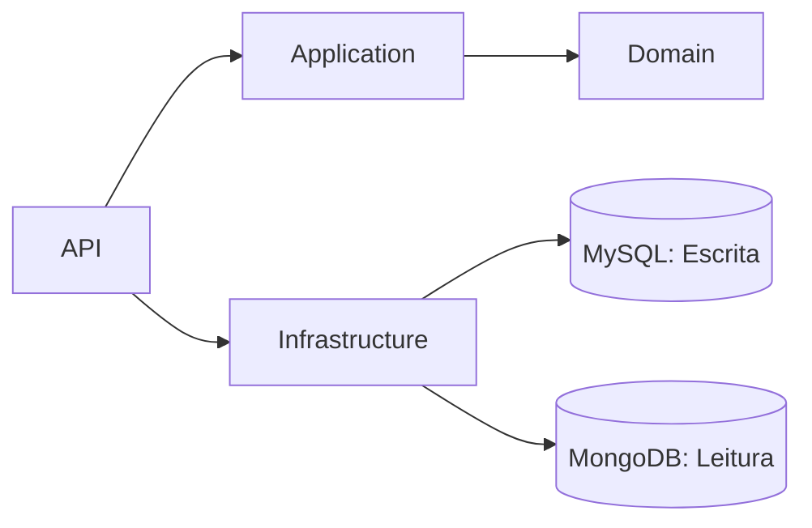

## FCG - FIAP Cloud Games

**MVP para uma plataforma de jogos voltados para a educação de tecnologia.**

A plataforma **FCG - FIAP Cloud Games** é um MVP voltado para a educação em tecnologia, com foco na venda de jogos digitais e gestão de servidores para partidas online. Este documento detalha a organização do projeto, ferramentas utilizadas, diagramas explicativos, arquitetura planejada, requisitos técnicos e instruções para execução e migrações. Confira as seções abaixo para mais informações:

## Sumário
- **[Organização](#organização):** Estrutura do time, reuniões e fluxo de trabalho.
- **[Ferramentas](#ferramentas):** Tecnologias e plataformas utilizadas no projeto.
- **[Diagramas](#diagramas):** Representações visuais do sistema, como Storytelling e Event Storming.
- **[Arquitetura](#arquitetura):** Estrutura do projeto e bibliotecas empregadas.
- **[Execução](#execução):** Requisitos, configuração e instruções para rodar o projeto.
- **[Migrations](#migrations):** Comandos para gerenciar alterações no banco de dados.

## Organização

Reuniões semanais são realizadas para acompanhar o progresso das tarefas, discutir aspectos técnicos e priorizar as demandas do projeto. Durante esses encontros, a equipe avalia os desafios enfrentados, ajusta o planejamento e define os próximos passos.

O fluxo de trabalho é gerenciado por meio de um board no Trello, estruturado com listas que representam os diferentes estágios de execução das tarefas. As atividades são movidas entre as listas conforme seu progresso, garantindo visibilidade e organização para todos os membros da equipe.

Fazem parte do quadro do time os seguintes membros:
 - [Paulo](https://github.com/paulobusch)
 - [Geovanne](https://github.com/gehcosta)
 - [Letícia](https://github.com/leticia-kojima)
 - [Matheus](https://github.com/M4theusVieir4)
 - [Marcelo](https://github.com/marceloalvees)

## Ferramentas
Esta seção descreve as ferramentas utilizadas no projeto para organização, documentação, colaboração e desenvolvimento. Abaixo estão listadas as principais ferramentas e suas respectivas finalidades:

- **[Trello](https://trello.com/):** Gestão do fluxo de trabalho, permitindo o acompanhamento das tarefas e organização das prioridades.
- **[Egon.io](https://egon.io/):** Elaboração do *Domain Storytelling*, facilitando o mapeamento das interações entre os atores e elementos do sistema.
- **[Notion](https://www.notion.so/):** Documentação e checklist das entregas, centralizando informações importantes do projeto.
- **[Miro](https://miro.com/):** Criação de diagramas de *Event Storming* e colaboração visual para *brainstorming* e planejamento.
- **[GitHub](https://github.com/):** Repositório para versionamento de código e colaboração entre os membros da equipe.
- **[Mermaid](https://mermaid-js.github.io/):** Ferramenta para criação de diagramas e gráficos baseados em texto, utilizada para representar a arquitetura do sistema.

## Diagramas

Os diagramas apresentados nesta seção fornecem uma visão abrangente do sistema. O **[Storytelling](#storytelling)** mapeia as interações entre os atores e elementos do domínio, destacando processos e relações essenciais. O **[Event Storming](#event-storming)** identifica eventos, comandos e agregados, detalhando as interações e mudanças de estado no sistema. Por fim, o **[Diagrama de Classes](#classes)** ilustra a estrutura das entidades e suas relações, oferecendo uma visão detalhada da modelagem do sistema.


### Storytelling

Um diagrama de fluxo foi elaborado utilizando a ferramenta [Egon.io](https://egon.io/) para mapear as interações entre os atores e os elementos do sistema. Este diagrama detalha as ações realizadas por cada ator, destacando os processos e as relações que ocorrem dentro do domínio da aplicação. Ele serve como uma base visual para compreender o funcionamento do sistema e identificar possíveis melhorias ou ajustes necessários.


A plataforma **FCG** prevê dois níveis de acesso diferentes, um para Administrador e outro para Usuário, representando os atores da aplicação. Do item 1 ao 3, o **Administrador** faz a gestão das informações dos usuários, catálogos e jogos. Já do item 4 ao 7, o **Usuário** pode criar uma conta, acessar os catálogos, baixar e fazer a avaliação de um jogo.

### Event Storming

O *Event Storming* foi realizado para mapear os principais eventos do sistema, identificar comandos, eventos e definir agregados. A equipe discutiu as interações entre os atores e elementos do domínio, criando um fluxograma que representa a sequência de eventos e interações. Com base nesse fluxograma, foram definidos os comandos que iniciam ações e os eventos que indicam mudanças de estado ou notificações. Os agregados foram identificados para agrupar entidades e garantir a consistência das operações no domínio. Os diagramas gerados estão disponíveis abaixo:


Os diagramas e fluxogramas do projeto utilizam as seguintes legendas para facilitar a compreensão:

- **AG (Agregado):** Conjunto lógico de entidades e objetos de valor tratados como uma unidade no domínio.
- **AT (Ator):** Usuário ou sistema externo que interage com a aplicação.
- **CMD (Comando):** Solicitação para executar uma ação ou alterar o estado do sistema.
- **EV (Evento):** Mudança de estado ou notificação ocorrida no sistema.
- **ML (Modelo de Leitura):** Estrutura otimizada para consultas e exibição de dados, derivada de um modelo de gravação.

### Classes
Com base nos diagramas apresentados anteriormente, foi desenvolvido o diagrama de classes do domínio. Abaixo estão detalhadas as classes principais e seus respectivos relacionamentos, representando a estrutura e a interação entre os componentes do sistema.


Todas as classes herdam de `EntityBase`, que encapsula propriedades comuns, como identificador único e datas de criação, modificação e deleção. A entidade `Catalog` representa os catálogos disponíveis na plataforma e pode ser associada a um ou mais jogos (`Game`). A classe `User` define os usuários do sistema, diferenciando seus papéis por meio da propriedade `Role`. Já as entidades `GameDownload` e `GameEvaluation` estabelecem um relacionamento de muitos-para-muitos entre `User` e `Game`, permitindo rastrear downloads e avaliações realizadas pelos usuários.

### Arquitetura

O projeto **FCG - FIAP Cloud Games** adota o padrão **CQRS (Command Query Responsibility Segregation)**, separando operações de leitura e escrita para maior desempenho e escalabilidade.

#### Projetos
- **FCG.API:** Exposição de endpoints.
- **FCG.Application:** Casos de uso e mediadores.
- **FCG.Domain:** Regras de negócio e entidades.
- **FCG.Infrastructure:** Persistência de dados.
- **FCG.UnitTests:** Testes unitários.

O diagrama a seguir apresenta as dependências entre as camadas da aplicação, destacando como elas interagem para compor a arquitetura do sistema:



### Principais Bibliotecas

Abaixo estão listadas as principais bibliotecas utilizadas no projeto, juntamente com uma breve descrição e links para suas respectivas documentações:

- **[MediatR](https://github.com/jbogard/MediatR):** Implementa o padrão *Mediator* para comunicação desacoplada.
- **[Scrutor](https://github.com/khellang/Scrutor):** Registro automático de serviços no *Dependency Injection* do .NET.
- **[Pomelo.EntityFrameworkCore.MySql](https://github.com/PomeloFoundation/Pomelo.EntityFrameworkCore.MySql):** Provedor EF Core para MySQL.
- **[MongoFramework](https://github.com/TurnerSoftware/MongoFramework):** Integração simplificada com MongoDB.
- **[AutoBogus](https://github.com/nickdodd79/AutoBogus):** Geração de dados fictícios para testes.
- **[NSubstitute](https://nsubstitute.github.io/):** Criação de *mocks* e *stubs* para testes unitários.
- **[xUnit](https://xunit.net/):** Framework de testes unitários para .NET.

Essas bibliotecas desempenham papéis fundamentais no desenvolvimento do projeto, contribuindo para a organização, testes e integração com os bancos de dados.

## Execução

Para trabalhar no projeto, é necessário garantir a execução dos servidores dos bancos de dados. Entretanto, se não os tiver, é possível fazer download nos links descritos na sub-seção seguinte.

### Requisitos e Ferramentas
 - **[Visual Studio Community 2022](https://visualstudio.microsoft.com/pt-br/vs/community/):** IDE recomendada para trabalhar no projeto.
 - **[MongoDB Community Server](https://www.mongodb.com/try/download/community):** Banco de dados não relacional utilizado para consultas.
 - **[MySQL Community Server](https://dev.mysql.com/downloads/mysql/):** Banco de dados relacional utilizado para comandos.

### Configuração

A conexão com cada um dos banco de dados é configurada no arquivo `appsettings.json`. Caso necessário, atualize com o usuário e senha definidos no servidor. A tabela abaixo detalha estas configurações.

| Chave | Descrição |
| - | - |
| `ConnectionStrings:FCGCommands` | String de conexão com o banco de dados **MySQL**. |
| `ConnectionStrings:FCGQueries` | String de conexão com o banco de dados **MongoDB**. |

### Debug e Teste

É necessário definir o projeto `FCG.API` como sendo de inicialização e escolher a opção `http` para executar a API. O arquivo `FCG.API.http` presente neste projeto, contempla os endpoints existentes. No Visual Studio aparecerá a opção para fazer debug e envio de requisições.

## Migrations

Para fazer atualizações nas tabelas do banco de dados é necessário gerar *migrations*. A seguir são apresentados os comandos que devem ser usados para fazer e aplicar estas alterações:

1. Faça, primeiro o acesso ao diretório do projeto de infraestrutura, por de um terminal PowerShell ou do gerenciador de pacotes do Visual Studio.
2. Execute o comando abaixo para registrar as alterações em uma migration:
    ```
    Add-Migration MigrationName
    ```
    Substitua `MigrationName` por um nome significativo que será dado à migration.


3. Aplique as alterações no banco de dados executando o comando abaixo:
    ```
    Update-Database
    ```

Também é possível fazer a remoção e reversão das *migrations* e alterações no banco de dados, caso necessário consulte a opção de ajuda do EF Core `Get-Help EntityFramework`.